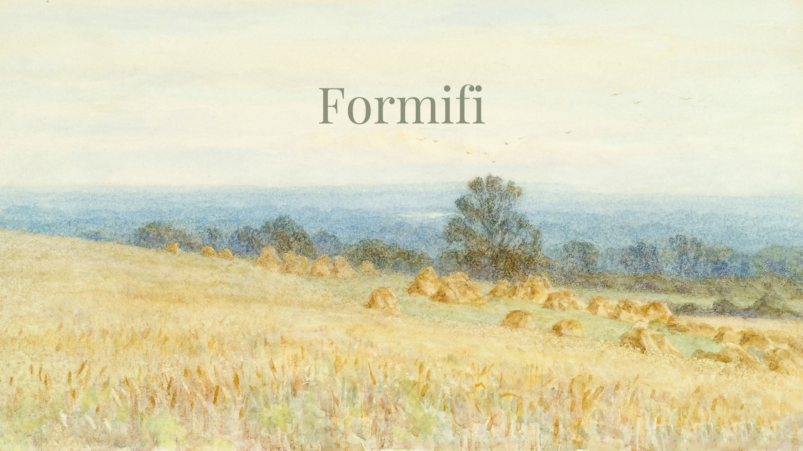

**FormiFi** is a form filling utility that has been developed to facilitate and monitor the process of claim filing for distribution of CFR as part of the Forest Governance initiative. It provides analytics support, offline mode and will soon be available in multiple languages.
